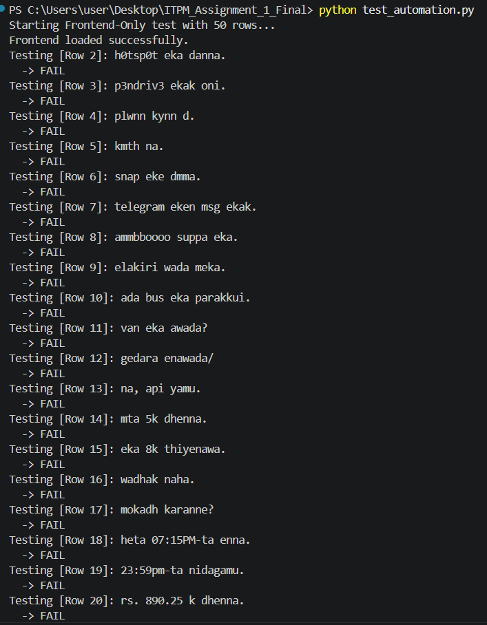
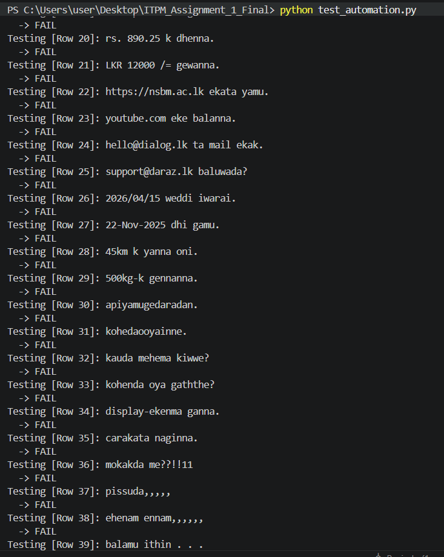
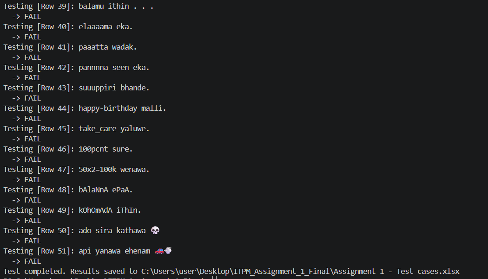

# ITPM Assignment 1 - Playwright Test Automation

## Installation Instructions
1. Install Python on your system.
2. Open the terminal and install the required dependencies:
   `pip install playwright openpyxl`
3. Install the Playwright browsers:
   `playwright install`

## How to Run the Tests
1. Ensure the `Assignment 1 - Test cases.xlsx` file is closed.
2. Run the automation script in the terminal:
   `python test_automation.py`s

## Here is the terminal output proving the 100% fail rate for the negative test cases:

